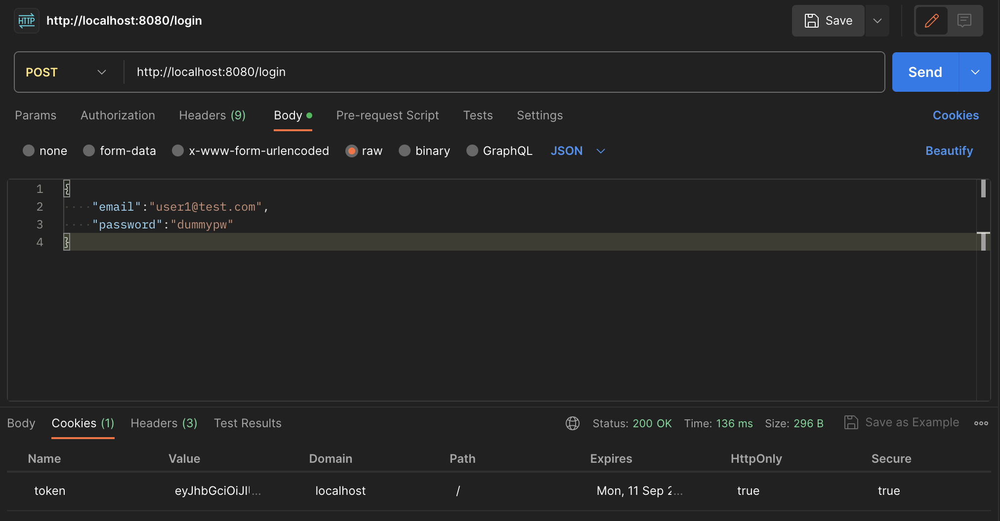

# try-di-api

これはクリーンアーキテクチャの学習に際し、[todo-webapp-by-golang](https://github.com/mz-akihiro/todo-webapp-by-golang)内のlogin用エンドポイントの代替となるものを、クリーンアーキテクチャに基づいて製作したものです。


# 説明

※前提として、[todo-webapp-by-golang](https://github.com/mz-akihiro/todo-webapp-by-golang)を使用し、「MySQLのdockerコンテナ・userテーブル・一つ以上のユーザアカウント」の作成が既に終わっている状態での説明になります。

``` bash
# 起動手順
go mod init try-di-api
go run main.go
```

起動確認後、以下のようにPostmanなどのツールを使用して事前に作成したアカウントのemail・passwordをjson形式で/loginエンドポイントに送信することで、動作を確認出来ます。

